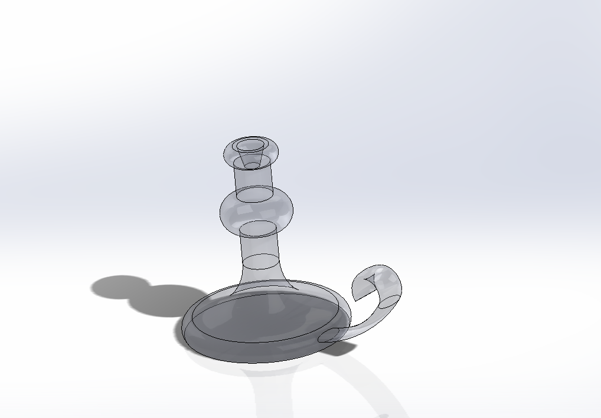
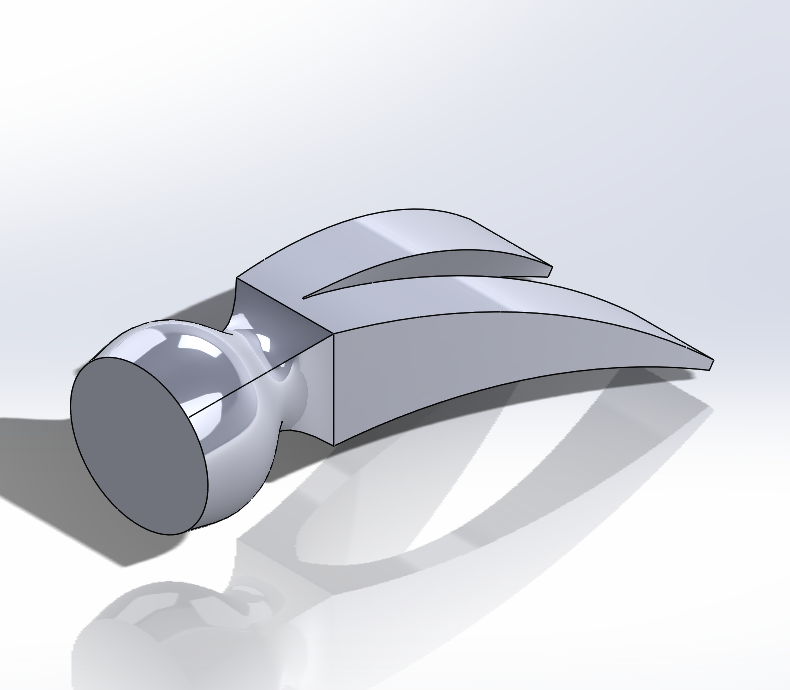
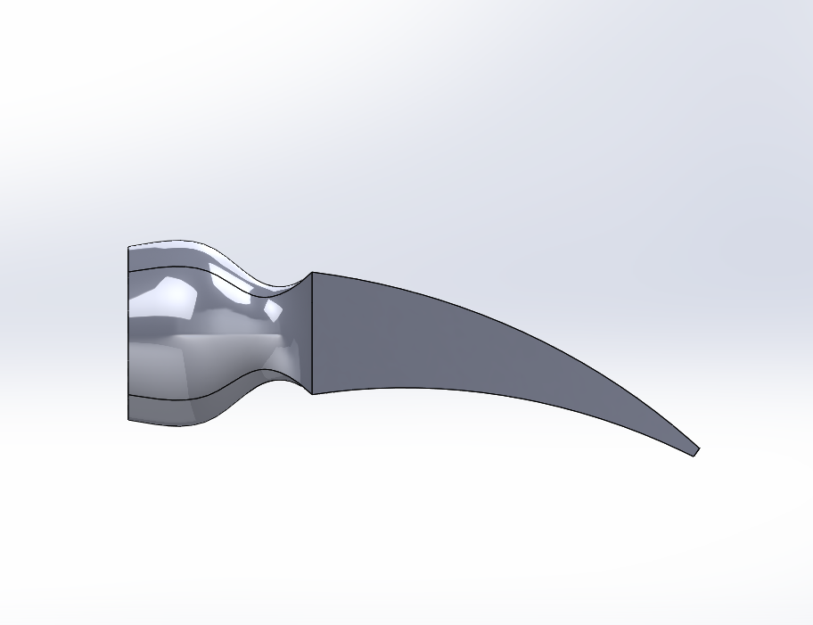

# Not So Basic CAD

## Table_of_Contents
### [A_Little_Practice](#a_little_practice)
- [Pictures](#pictures_alp)
- [Task](#task_alp)
- [Problems](#problems_alp)

### [Sweeps and Lofts](sweeps_and_lofts)
- [Pictures](#pictures_sal)
- [Task](#task_sal)
- [Problems](#problems_sal)

## A_Little_Practice

### Pictures_ALP

### Task_ALP
>Open up SolidWorks.  Click Tutorials on the right.  Under "Getting Started" you are to complete:
> 1. Introduction to SolidWorks
  > - Lesson 1: Parts
  > - Lesson 2: Assemblies \
>Show me the intro part and the assembly when you're done.

### Problems_ALP
None, really. It was all pretty straightforward.
## Sweeps_and_Lofts

### Pictures_SaL

### Task_SaL
>Open up SolidWorks.  If the Welcome dialog doesn't pop up, click the house icon on the top. 

>Click the Learn tab, then click the big blue Tutorials box.  Finally, select  Basic Techniques.   You are to complete the following two tutorials:

>1. Revolves and Sweeps	2. Lofts
>For the Lofts assignment, I am adding one simple requirement:

>Once the tutorial has been completed, roll back your features to just before the flex.
>Go find a hammer in the lab, and look at the claw slot (the part you pry a nail out with).
>Use a Lofted Cut to create your claw slot.
>Roll the flex back on.
>Bask in how awesome this looks, and wonder why SolidWorks didn't include this in their tutorial.
### Problems_SaL
Flexing the part is an absolute pain. I'd probably have to redo the tutorial in order to be able to fully put it under my toolbelt
Sweeps make a lot more sense; you are painting a 2D Shape through a 3D path. A cyllender is a sweep of a circle straight up.
Lofts are a bit more... interesting.
when thinking about them, I like working backwards. So you have your dream shape in your head, what 2D faces do you need to accurately recreate it? after that is figured out, you can usually trial and error it out.
Also, WHERE YOU CLICK MATTERS!!! I aim to go for the same corner so that it doesn't compress in on itself. 

For the claw of the hammer, i made the cut Trapezoidal. Triangular could probably also work.
